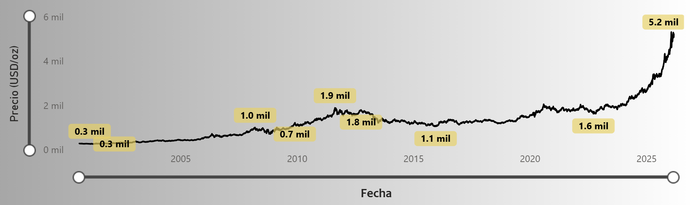

# 🪙 Precio del Oro en Tiempo Real (2000 - Actualidad)

Dashboard interactivo desarrollado en **Power BI**, utilizando modelado de datos y medidas avanzadas en **DAX**, diseñado para analizar la evolución del **precio del oro desde el año 2000 hasta la actualidad**. 

El proyecto integra datos históricos con procesos de actualización automatizada, permitiendo explorar tendencias del mercado, indicadores clave (KPIs), rendimientos acumulados y variaciones del precio a lo largo del tiempo. 

A través de visualizaciones dinámicas y filtros interactivos, el dashboard facilita el análisis del comportamiento del oro en distintos periodos, proporcionando una herramienta analítica que permite identificar patrones, evaluar fluctuaciones del mercado y apoyar la toma de decisiones basada en datos.

---

## 🎯 Objetivo del Proyecto

El objetivo de este proyecto es analizar el comportamiento del precio del oro a lo largo del tiempo mediante visualizaciones interactivas que permitan:

- Identificar tendencias del mercado.
- Analizar variaciones del precio del oro.
- Evaluar periodos de crecimiento y caída.
- Explorar información histórica de manera dinámica.

---

## ⚙️ Tecnologías Utilizadas

- Python (extracción y actualización de datos)
- Power BI (visualización de datos)
- CSV Dataset
- Scripts de automatización Batch

---

## 📂 Estructura del Proyecto

- **Extraccion_data_oro.py** → Script para obtener y actualizar datos.
- **Oro_historico_2000.csv** → Dataset histórico del precio del oro.
- **PROYECTO ORO - TIEMPO REAL.pbix** → Dashboard interactivo en Power BI.
- **Bat_Actualizar_Data.bat** → Script para automatizar la actualización de datos.

---

## 📊 Funcionalidades del Dashboard

- Análisis histórico del precio del oro.
- Visualización de tendencias del mercado.
- Exploración dinámica mediante filtros.
- Seguimiento del precio del oro en tiempo real.

---

## 👨‍💻 Autor

**Fernando Chávez**  
Proyecto de análisis de datos y visualización financiera.
